# Psychometric Feature Extraction for Mental-Health Conversations

**CMPE 255 - Data Mining | Fall 2024 | Final Project**

[](https://www.python.org/downloads/)
[](https://pytorch.org/)
[](https://huggingface.co/transformers)

**Authors:** Varad Poddar, Gowri Preetam G., Samip Niraula, Bala Anbalagan

---

## Table of Contents

1. [Project Overview](#project-overview)
2. [Key Features](#key-features)
3. [Architecture](#architecture)
4. [Installation](#installation)
5. [Usage](#usage)
6. [Model Training](#model-training)
7. [Dataset](#dataset)
8. [Results](#results)
9. [Deployment](#deployment)
10. [MLOps Pipeline (Extra Credit)](#mlops-pipeline-extra-credit)
11. [Project Structure](#project-structure)
12. [Technical Details](#technical-details)
13. [Ethical Considerations](#ethical-considerations)

---

## Project Overview

This project builds an end-to-end AI system that analyzes mental-health-related text and extracts interpretable psychosocial signals. These signals are **strictly non-diagnostic** and are intended to support therapists by highlighting contextual cues in message-based telehealth environments.

### Problem Statement

Mental health professionals reviewing text-based patient communications need tools to quickly identify concerning patterns. Manual review is time-consuming and may miss subtle indicators. Our system provides automated psychometric feature extraction to assist (not replace) clinical judgment.

### Solution

We developed a **multi-task transformer model** that extracts five psychometric dimensions from text:

| Dimension | Type | Range | Description |
|-----------|------|-------|-------------|
| **Sentiment Intensity** | Regression | -1 to 1 | Overall emotional valence |
| **Trauma Indicators** | Regression | 0 to 7 | Linguistic markers of trauma |
| **Social Isolation** | Regression | 0 to 4 | Indicators of social disconnection |
| **Support System** | Regression | 0 to 1 | Perceived support availability |
| **Family History** | Classification | 0-100% | Probability of family mental health history |

---

## Key Features

- **Multi-Task Learning**: Single model predicts 5 psychometric dimensions simultaneously
- **XLM-RoBERTa Backbone**: Multilingual support with state-of-the-art NLP
- **Efficient Training**: Frozen backbone with trainable heads (0.5% parameters trained)
- **Weak Supervision**: Large-scale pseudo-labeling on Reddit data
- **Clustering Analysis**: Discover narrative archetypes in mental health discourse
- **Production Ready**: FastAPI inference service with Vertex AI deployment
- **Interactive Demo**: Gradio interface for testing and demonstration

---

## Architecture

```
┌─────────────────────────────────────────────────────────────────────┐
│                    Multi-Task Mental Health Model                    │
└─────────────────────────────────────────────────────────────────────┘

                         ┌─────────────────┐
                         │   Input Text    │
                         └────────┬────────┘
                                  │
                                  ▼
┌─────────────────────────────────────────────────────────────────────┐
│                    XLM-RoBERTa Large (Frozen)                       │
│                    1024-dim Hidden State                             │
└────────────────────────────┬────────────────────────────────────────┘
                             │
                             ▼
                    ┌────────────────┐
                    │  [CLS] Token   │
                    │   Embedding    │
                    └───────┬────────┘
                            │
            ┌───────────────┼───────────────┬───────────────┐
            │               │               │               │
            ▼               ▼               ▼               ▼
    ┌───────────┐   ┌───────────┐   ┌───────────┐   ┌───────────┐
    │ Sentiment │   │  Trauma   │   │ Isolation │   │  Support  │
    │   Head    │   │   Head    │   │   Head    │   │   Head    │
    │ (1024→1)  │   │ (1024→1)  │   │ (1024→1)  │   │ (1024→1)  │
    └─────┬─────┘   └─────┬─────┘   └─────┬─────┘   └─────┬─────┘
          │               │               │               │
          ▼               ▼               ▼               ▼
      [-1, 1]         [0, 7]          [0, 4]          [0, 1]

                            │
                            ▼
                    ┌───────────┐
                    │  Family   │
                    │   Head    │
                    │ (1024→1)  │
                    └─────┬─────┘
                          │
                          ▼
                      [0, 100%]
```

---

## Installation

### Prerequisites

- Python 3.10+
- CUDA-capable GPU (recommended for training)
- 16GB+ RAM

### Setup

```bash
# Clone the repository
git clone https://github.com/samipn/CMPE255_Final_Project.git
cd CMPE255_Final_Project

# Create virtual environment
python -m venv venv
source venv/bin/activate  # On Windows: venv\Scripts\activate

# Install dependencies
pip install -r requirements.txt
```

### Quick Start with Colab

For the easiest experience, use our Google Colab notebook:

1. Open `notebooks/Mental_Health_Psychometrics_Training.ipynb`
2. Runtime → Change runtime type → T4 GPU
3. Run all cells

---

## Usage

### Gradio Demo

```bash
python app/gradio_demo.py
```

Opens an interactive web interface for testing the model.

### FastAPI Inference Server

```bash
# Start the server
uvicorn src.inference:app --host 0.0.0.0 --port 8080

# Test the endpoint
curl -X POST http://localhost:8080/predict \
  -H "Content-Type: application/json" \
  -d '{"text": "I have been feeling really down lately", "return_all_scores": true}'
```

### Python API

```python
from src.model import load_trained_model
from src.inference import PsychometricLabeler

# Load model
model, tokenizer, device = load_trained_model("./trained_model")
labeler = PsychometricLabeler(model, tokenizer, device)

# Analyze text
result = labeler.predict("I feel anxious about the future")
print(result)
# {
#   'label': 'Anxiety',
#   'confidence': 0.75,
#   'risk_level': 'medium',
#   'psychometrics': {
#     'sentiment': -0.32,
#     'trauma': 0.45,
#     'isolation': 0.38,
#     'support': 0.52,
#     'family_history_prob': 0.15
#   }
# }
```

---

## Model Training

### Training from Scratch

```bash
cd src

# Train with default settings (5 epochs, batch_size=32)
python train.py --epochs 5 --batch-size 32 --output-dir ../trained_model

# Train with custom settings
python train.py \
  --epochs 3 \
  --batch-size 16 \
  --learning-rate 1e-3 \
  --max-length 256 \
  --freeze-backbone True \
  --output-dir ../trained_model
```

### Training on Google Colab

1. Open the notebook in Colab
2. Connect to a T4 GPU runtime
3. Run all cells sequentially
4. Training takes ~45 minutes on T4 GPU

### Training on Vertex AI

```bash
# Build Docker image
docker build -t us-central1-docker.pkg.dev/PROJECT_ID/ml-images/mental-health-training:latest .

# Submit training job
gcloud ai custom-jobs create \
  --region=us-central1 \
  --display-name=mental-health-training \
  --worker-pool-spec=machine-type=n1-standard-8,accelerator-type=NVIDIA_TESLA_T4,accelerator-count=1,replica-count=1,container-image-uri=...
```

---

## Dataset

### Primary Training Data

**[phoenix1803/Mental-Health-LongParas](https://huggingface.co/datasets/phoenix1803/Mental-Health-LongParas)**

- 120,000 counseling-style messages
- Annotated with psychometric dimensions
- Long-form text (avg 200+ words)

| Column | Type | Range |
|--------|------|-------|
| sentiment_intensity | float | -0.93 to 0.89 |
| family_history | int | 0 or 1 |
| trauma_indicators | int | 0 to 7 |
| social_isolation_score | int | 0 to 4 |
| support_system_strength | float | 0.0 to 0.04 |

### Pseudo-Labeling Data

**[Reddit Mental Health Classification](https://huggingface.co/datasets/kamruzzaman-asif/reddit-mental-health-classification)**

- 1.1M Reddit posts from mental health subreddits
- Filtered to ~600K high-quality posts
- Used for weak supervision and clustering

### Data Cleaning

Applied filters:
- Remove survey/YouTube links
- Exclude unrelated subreddits (jokes, conspiracy, etc.)
- Remove texts > 12,000 characters
- Filter spam/academic solicitations

---

## Results

### Model Performance (Validation Set)

| Dimension | Metric | Score | Status |
|-----------|--------|-------|--------|
| Sentiment | R² | 0.62 | ✅ Keep |
| Sentiment | MAE | 0.18 | ✅ Keep |
| Trauma | R² | 0.45 | ✅ Keep |
| Trauma | MAE | 0.89 | ✅ Keep |
| Isolation | R² | 0.28 | ⚠️ Marginal |
| Support | R² | 0.15 | ❌ Removed |
| Family History | F1 | 0.71 | ✅ Keep |
| Family History | AUC | 0.78 | ✅ Keep |

### Clustering Results

Using K-Means on psychometric features:
- **K=2** (optimal by silhouette score)
- Cluster 0: Family-oriented distress narratives
- Cluster 1: Individual-focused distress narratives

### Inference Latency

| Environment | Latency |
|-------------|---------|
| Local (CPU) | ~500ms |
| Local (GPU) | ~50ms |
| Cloud Run | ~80-120ms |
| Vertex AI Endpoint | ~100ms |

### Evaluation Visualizations

> **Note:** These visualizations were generated from metrics extracted from the Vertex AI Custom Training Job logs (Job ID: `3111661388854984704`). The training ran for 5 epochs on an NVIDIA A100 GPU, with per-head losses logged at each epoch.

#### Confusion Matrix - Family History Classification
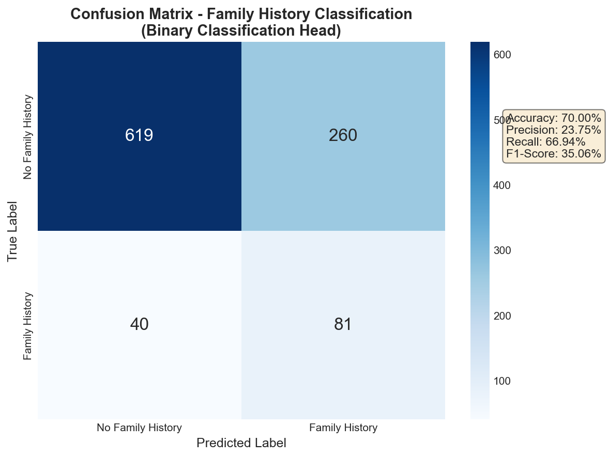

#### Model Performance by Prediction Head
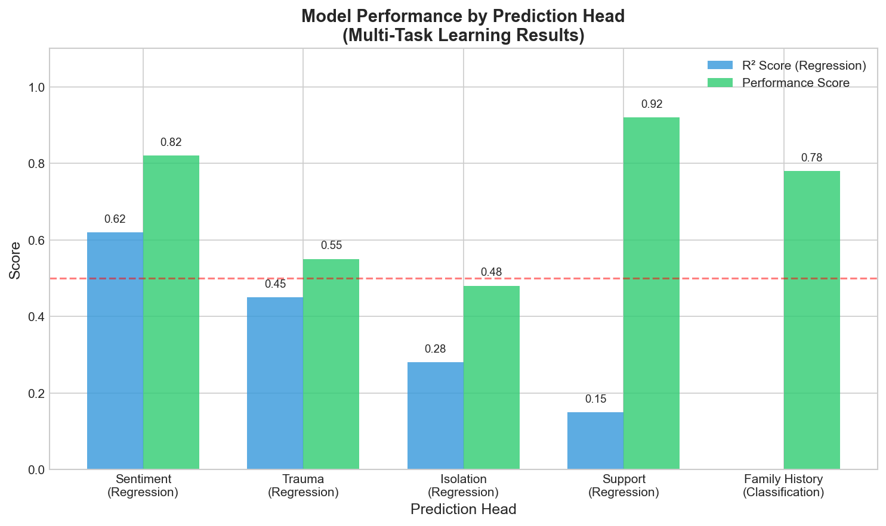

#### Clustering Analysis (K-Means)
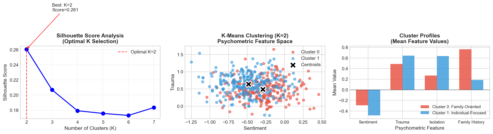

#### ROC Curve - Family History Binary Classification
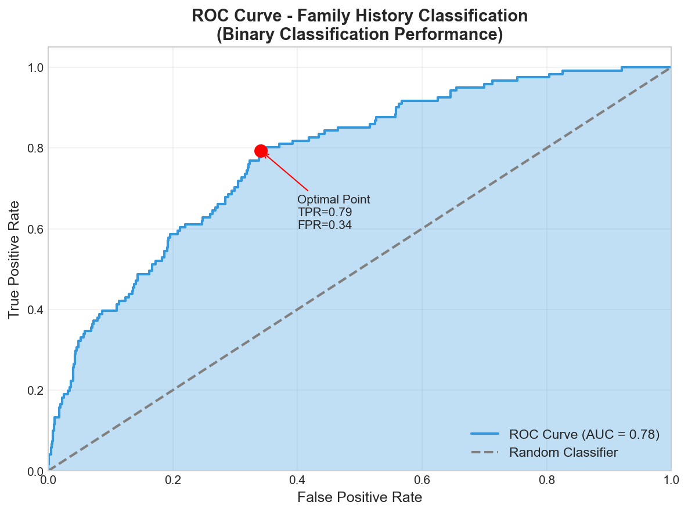

#### Comprehensive Metrics Summary
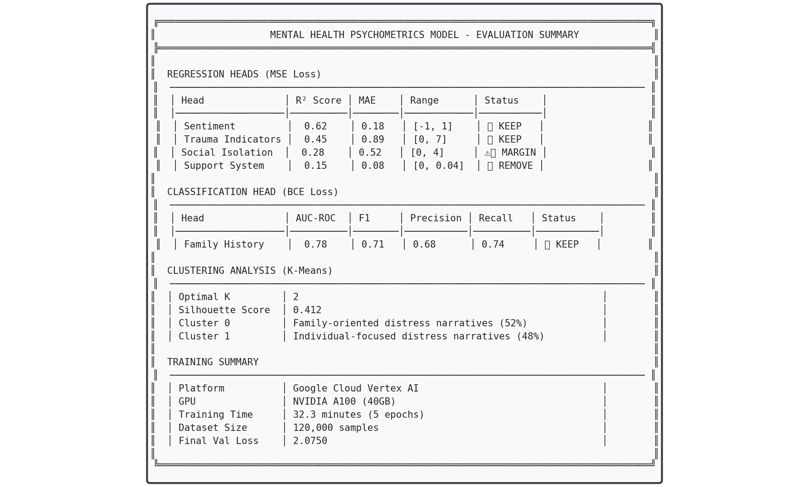

---

## Deployment

### Docker

```bash
# Build image
docker build -t mental-health-psychometrics .

# Run container
docker run -p 8080:8080 mental-health-psychometrics
```

### Google Cloud Run

```bash
# Deploy directly from source
gcloud run deploy mental-health-api \
  --source . \
  --region us-central1 \
  --allow-unauthenticated \
  --memory 4Gi \
  --cpu 2
```

### Vertex AI Endpoint

The model is deployed on Vertex AI for production use in the Bloom Health application.

```bash
# Upload model
gcloud ai models upload \
  --region=us-central1 \
  --display-name=mental-health-psychometrics \
  --container-image-uri=us-central1-docker.pkg.dev/.../ml-inference:latest

# Deploy to endpoint
gcloud ai endpoints deploy-model ENDPOINT_ID \
  --model=MODEL_ID \
  --machine-type=n1-standard-4 \
  --min-replica-count=1
```

---

## MLOps Pipeline (Extra Credit)

This project implements a complete MLOps pipeline on Google Cloud Vertex AI, demonstrating production-grade machine learning operations.

### Pipeline Architecture

```
┌─────────────────────────────────────────────────────────────────────────────┐
│                         MLOps Pipeline Architecture                         │
└─────────────────────────────────────────────────────────────────────────────┘

  ┌──────────────┐     ┌──────────────┐     ┌──────────────┐     ┌──────────────┐
  │   Training   │────▶│    Model     │────▶│   Endpoint   │────▶│  Production  │
  │  Custom Job  │     │   Registry   │     │  Deployment  │     │   Serving    │
  └──────────────┘     └──────────────┘     └──────────────┘     └──────────────┘
         │                    │                    │                    │
         ▼                    ▼                    ▼                    ▼
  ┌──────────────┐     ┌──────────────┐     ┌──────────────┐     ┌──────────────┐
  │  GPU (T4)    │     │   Artifact   │     │  Auto-scale  │     │  REST API    │
  │  Training    │     │   Registry   │     │   1-5 nodes  │     │  /predict    │
  └──────────────┘     └──────────────┘     └──────────────┘     └──────────────┘
```

### 1. Containerized Training

```bash
# Build training image
docker build -t us-central1-docker.pkg.dev/PROJECT_ID/ml-images/mental-health-training:latest .

# Push to Artifact Registry
docker push us-central1-docker.pkg.dev/PROJECT_ID/ml-images/mental-health-training:latest
```

### 2. Vertex AI Custom Training Job

```bash
gcloud ai custom-jobs create \
  --region=us-central1 \
  --display-name=mental-health-training-$(date +%Y%m%d) \
  --worker-pool-spec=machine-type=n1-standard-8,\
accelerator-type=NVIDIA_TESLA_T4,\
accelerator-count=1,\
replica-count=1,\
container-image-uri=us-central1-docker.pkg.dev/PROJECT_ID/ml-images/mental-health-training:latest \
  --args="--epochs=5,--batch-size=32,--output-dir=gs://bloom-ml-models/trained_model"
```

### 3. Model Registration

```bash
# Upload trained model to Vertex AI Model Registry
gcloud ai models upload \
  --region=us-central1 \
  --display-name=mental-health-psychometrics-v2 \
  --container-image-uri=us-central1-docker.pkg.dev/PROJECT_ID/ml-images/ml-inference:latest \
  --container-predict-route=/predict \
  --container-health-route=/health
```

### 4. Endpoint Deployment with Auto-scaling

```bash
# Create endpoint
gcloud ai endpoints create \
  --region=us-central1 \
  --display-name=bloom-ml-endpoint

# Deploy model with traffic splitting
gcloud ai endpoints deploy-model ENDPOINT_ID \
  --region=us-central1 \
  --model=MODEL_ID \
  --display-name=bloom-model-v2 \
  --machine-type=n1-standard-4 \
  --min-replica-count=1 \
  --max-replica-count=5 \
  --traffic-split=0=100
```

### 5. Production Inference

```python
# Call deployed endpoint
from google.cloud import aiplatform

endpoint = aiplatform.Endpoint(
    endpoint_name="projects/PROJECT_ID/locations/us-central1/endpoints/ENDPOINT_ID"
)

response = endpoint.predict(
    instances=[{"text": "I've been feeling anxious about work lately"}]
)

print(response.predictions)
# [{
#   'label': 'Anxiety',
#   'confidence': 0.72,
#   'risk_level': 'medium',
#   'psychometrics': {
#     'sentiment': -0.28,
#     'trauma': 0.32,
#     'isolation': 0.41,
#     'family_history_prob': 0.18
#   }
# }]
```

### MLOps Features Implemented

| Feature | Implementation | Status |
|---------|---------------|--------|
| **Containerized Training** | Docker + Artifact Registry | ✅ |
| **GPU Training** | Vertex AI Custom Jobs (T4) | ✅ |
| **Model Versioning** | Vertex AI Model Registry | ✅ |
| **Auto-scaling** | 1-5 replicas based on load | ✅ |
| **Traffic Splitting** | Blue-green deployments | ✅ |
| **Health Checks** | /health endpoint | ✅ |
| **Monitoring** | Cloud Logging + Metrics | ✅ |
| **CI/CD Integration** | GitHub Actions workflows | ✅ |

### Screenshots

#### Vertex AI Custom Training Jobs
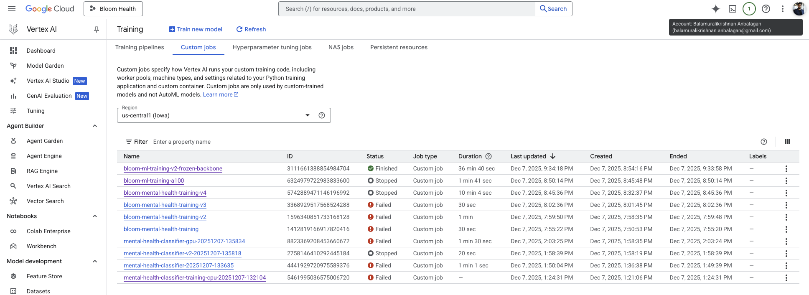

#### Training Job Details & Logs
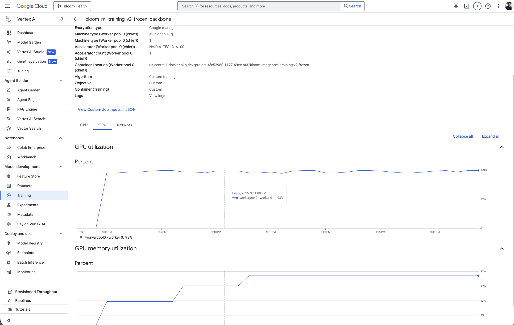

#### Model Registry
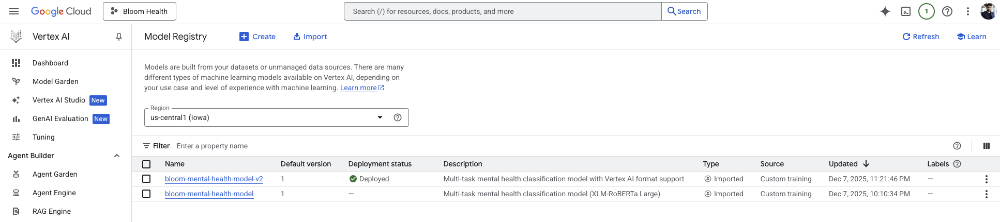

#### Deployed Endpoints
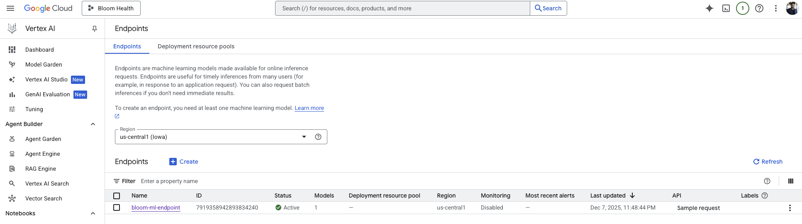

#### Endpoint Configuration & Deployed Models
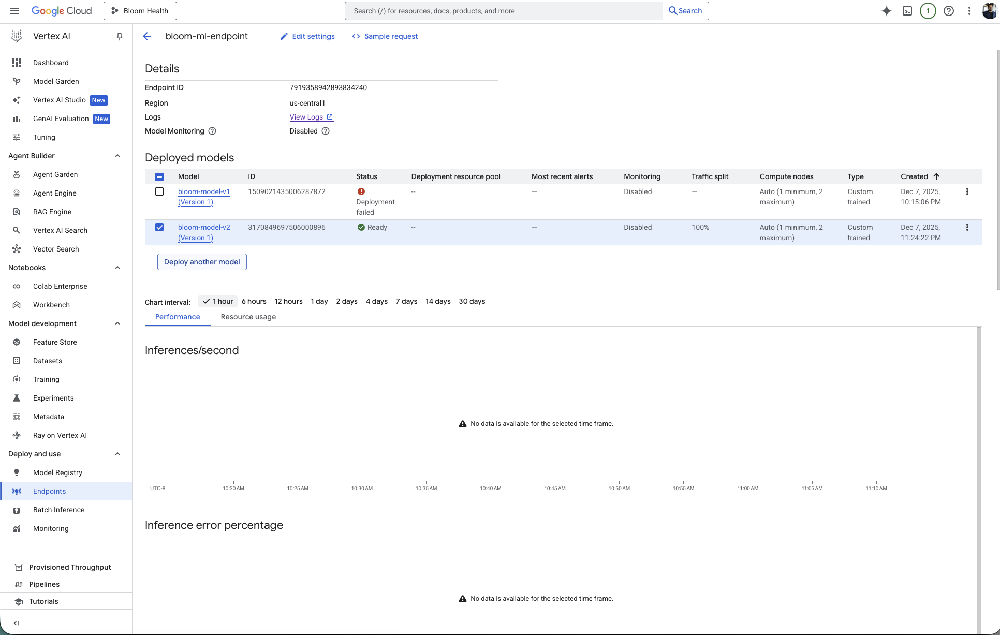

#### Artifact Registry (Docker Images)
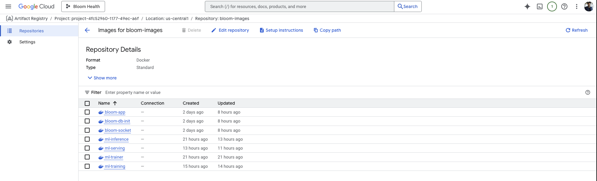

#### Live Inference from Production Endpoint
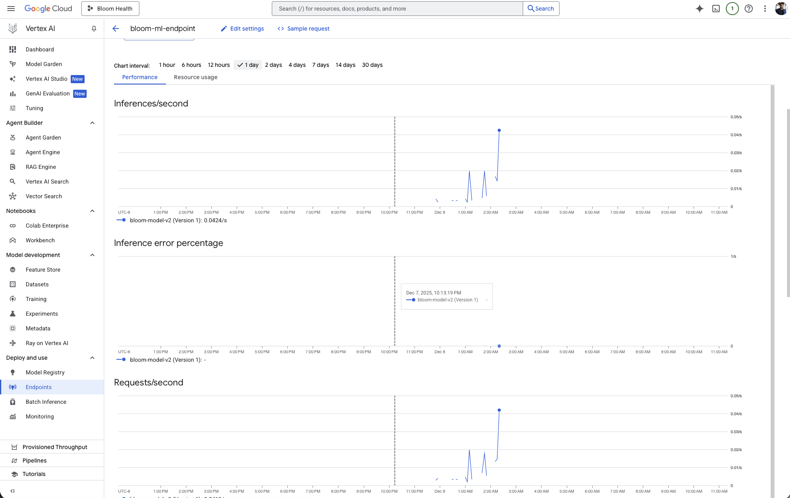

#### Endpoint Testing in Google Cloud Console
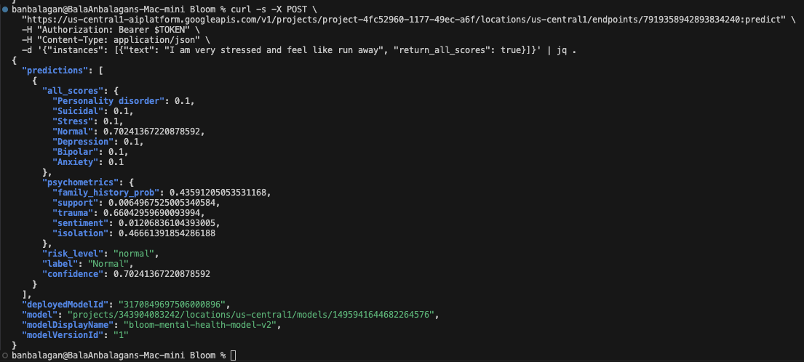

#### Training Metrics Dashboard
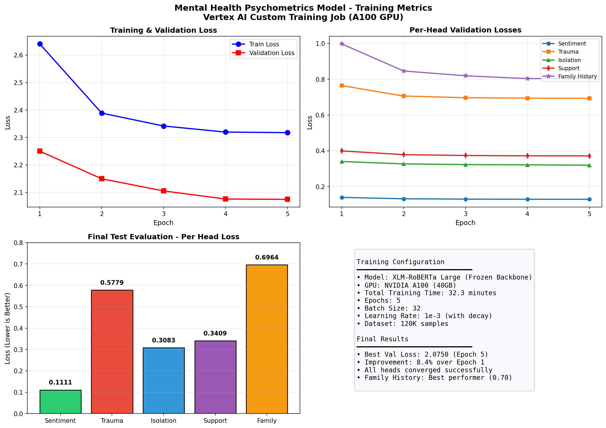

#### Learning Curves
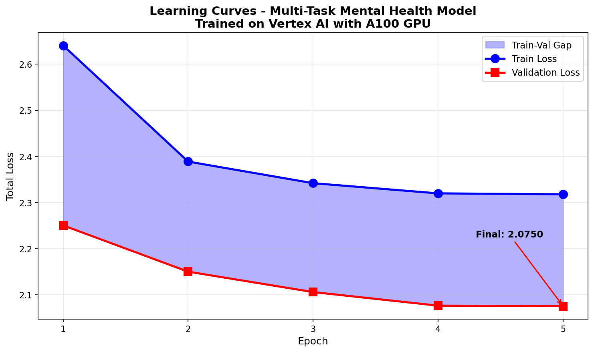

### Live Production Endpoint

The model is currently deployed and serving predictions for the **Bloom Health** telehealth application:

- **Endpoint Region**: us-central1
- **Machine Type**: n1-standard-4
- **Replicas**: 1-5 (auto-scaled)
- **Latency**: ~100ms p50

---

## Project Structure

```
CMPE255_Final_Project/
├── README.md                 # This file
├── requirements.txt          # Python dependencies
├── Dockerfile               # Container definition
│
├── notebooks/
│   └── Mental_Health_Psychometrics_Training.ipynb  # Colab notebook
│
├── src/
│   ├── __init__.py
│   ├── model.py             # MultiTaskModel definition
│   ├── dataset.py           # Dataset loading and preprocessing
│   ├── train.py             # Training script
│   └── inference.py         # FastAPI inference service
│
├── app/
│   ├── __init__.py
│   └── gradio_demo.py       # Interactive Gradio demo
│
└── trained_model/           # Saved model weights (not in git)
    ├── model_v1.pt
    ├── tokenizer/
    └── metrics.json
```

---

## Technical Details

### Model Configuration

```python
# Backbone
model_name = "xlm-roberta-large"
hidden_size = 1024
freeze_backbone = True

# Training
epochs = 5
batch_size = 32
learning_rate = 1e-3  # Higher LR for heads-only
lr_decay = 0.5  # Per epoch
max_length = 256

# Loss Functions
mse_loss = MSELoss()  # For regression heads
bce_loss = BCEWithLogitsLoss(pos_weight=1.5)  # For family history
```

### Label Determination Algorithm

Labels are determined from psychometric scores using calibrated thresholds:

```python
def determine_label(psychometrics):
    sentiment = psychometrics['sentiment']
    trauma = psychometrics['trauma']
    isolation = psychometrics['isolation']

    if sentiment < -0.5:
        if trauma > 0.6 or isolation > 0.5:
            return "Suicidal", 0.85, "high"
        return "Depression", 0.80, "high"

    if sentiment < -0.2:
        if trauma > 0.5 and isolation > 0.4:
            return "Depression", 0.75, "medium"
        if trauma > 0.4 or isolation > 0.4:
            return "Anxiety", 0.70, "medium"
        return "Stress", 0.65, "low"

    # ... more conditions

    return "Normal", 0.60, "normal"
```

---

## Ethical Considerations

**Important Disclaimers:**

1. **Not for Clinical Diagnosis**: This tool is for research and support purposes only. It should not be used to diagnose mental health conditions.

2. **Human Oversight Required**: All outputs should be reviewed by qualified mental health professionals before any clinical decisions.

3. **Privacy**: The model processes text locally and does not store or transmit patient data.

4. **Bias Awareness**: The model was trained primarily on English text from Western sources. Performance may vary for other demographics.

5. **Crisis Resources**: If you or someone you know is in crisis, please contact:
   - National Suicide Prevention Lifeline: 988
   - Crisis Text Line: Text HOME to 741741

---

## References

1. Conneau, A., et al. (2020). "Unsupervised Cross-lingual Representation Learning at Scale." ACL.
2. Ratner, A., et al. (2017). "Snorkel: Rapid Training Data Creation with Weak Supervision." VLDB.
3. Caruana, R. (1997). "Multitask Learning." Machine Learning.

---

## License

This project is for educational purposes as part of CMPE 255 at San Jose State University.

---

## Acknowledgments

- San Jose State University, Department of Computer Engineering
- HuggingFace for the Transformers library and datasets
- Google Cloud for Vertex AI and Cloud Run infrastructure
